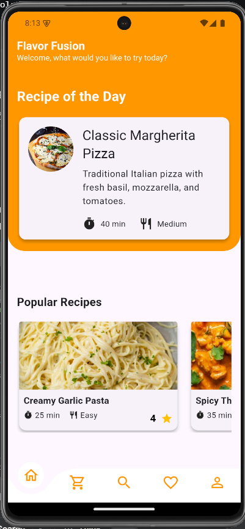
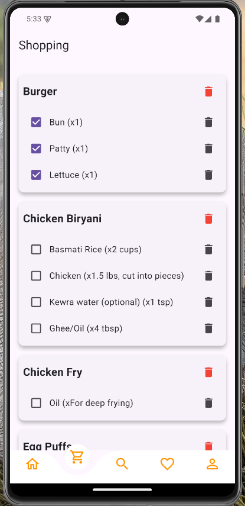
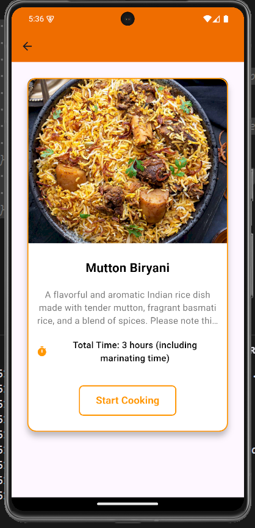
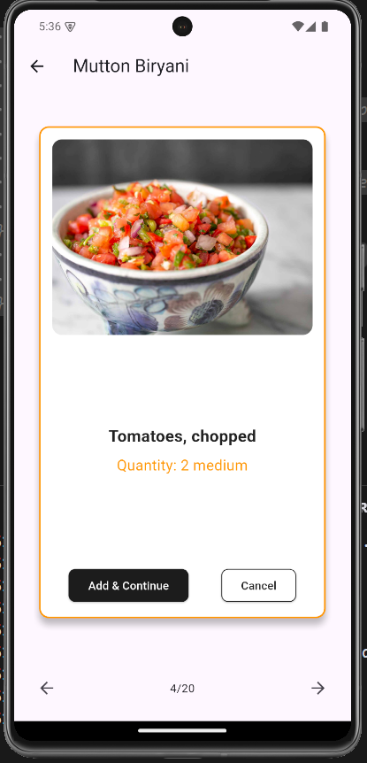
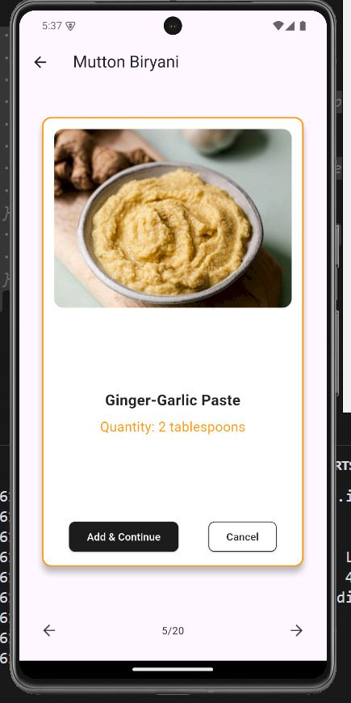
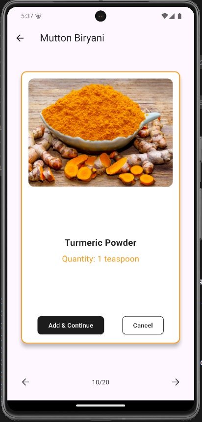
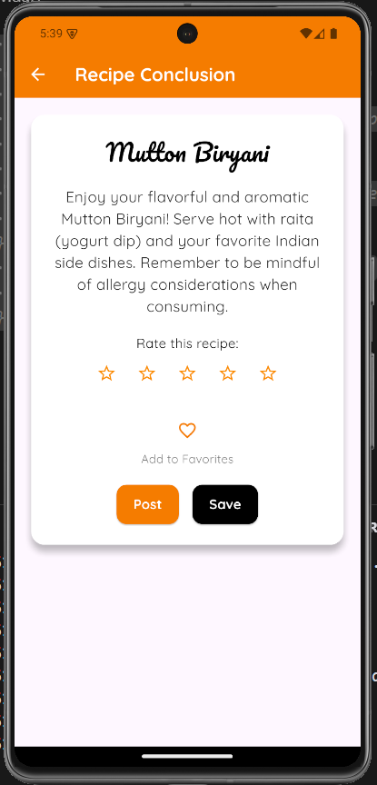

# flavorfusion

A new Flutter project focused on AI-powered recipe generation and more!

## Features

This application boasts a rich set of features designed to make cooking more intuitive and fun:

* **AI Recipe Generation:** Harnessing the advanced capabilities of the Google Gemini 1.5 trillion token model, this app can generate unique and delicious recipes based on your preferences and available ingredients.
* **Google Image JSON Search API Integration:** Discover visually appealing images of your generated recipes, enhancing your cooking inspiration.
* **Alarm System:** Never miss a step in your recipe! The integrated alarm system allows you to set reminders for crucial cooking stages.
* **Voice Assistant:** Hands full in the kitchen? No problem! Utilize the Flutter TTS package for a voice assistant that can read out recipe steps and instructions.

## Technologies Used

This project utilizes the following key technologies:

* **Flutter:** Google's UI toolkit for building beautiful, natively compiled applications for mobile, web, and desktop from a single codebase.
* **Google Gemini 1.5 Trillion Token Model:** A cutting-edge AI model used for intelligent recipe generation.
* **Google Image JSON Search API:** For fetching relevant and appealing images of the generated recipes.
* **Flutter TTS (Text-to-Speech):** Provides voice assistance for reading out recipe details.

## Image Upload

*(You mentioned having images to upload. You'll typically handle image uploads through your backend or a cloud storage service. This section provides a general idea.)*

This application may include functionality for users to upload images related to their cooking experiences or ingredients. The specific implementation for image uploads would depend on the chosen backend infrastructure and cloud storage solutions.

## Next Steps and Contributions

We are excited about the potential of flavorfusion and welcome contributions from the Flutter development community. If you have ideas for new features, improvements, or bug fixes, please feel free to open an issue or submit a pull request.

## Stay Tuned!

We are continuously working on enhancing flavorfusion to bring you the best possible cooking companion. Stay tuned for future updates and exciting new features!

